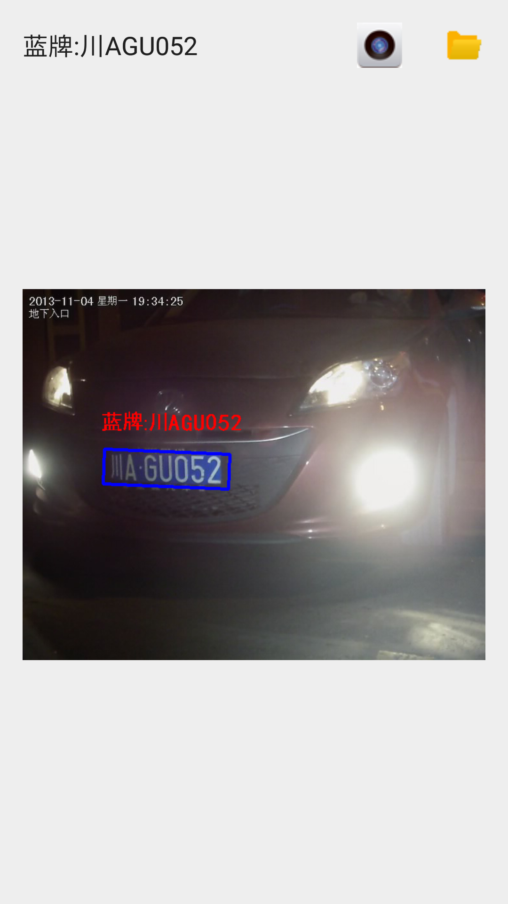

## 基于EasyPR的车牌识别android实现

EasyPR4Android，基于[EasyPR](https://github.com/liuruoze/EasyPR)1.6的android实现, 提供编译好的[mrcar.apk](mrcar.apk)安装运行demo.

### 更新：

* 升级到1.6版

* 添加putText中文支持

* 采用动态注册机制注册jni函数

* 将模型路径带入初始化函数中使得模型位置可以自由指定

* 采用CMake大幅简化ndk开发的配置

### 特性：

* 1.支持拍照和支持图库浏览识别

* 2.ndk调用OpenCV

* 3.从assets读取并复制文件

* 4.采用多线程进行识别处理

* 5.支持单击进行原图和识别结果之间的切换

采用android studio3.2开发实现，ndk版本为R16b，OpenCV版本为3.2，android SDK版本为28，最低要求21。

app启动时会默认从assets加载测试图片，并进行识别，返回结果。点击相机按钮进行拍照识别，点击文件夹按钮从图库选择文件进行识别（兼容android 4.4版本及以上）。

### 编译方法：

* 1.下载并配置[android studio 3.2](http://www.android-studio.org/)

* 2.安装编译环境[ndk r16b](http://blog.csdn.net/shuzfan/article/details/52690554)

* 3.配置opencv库，opencv android3.2版
使得解压后的OpenCV-android-sdk与本工程根目录处于同一级目录

* 4.编译并运行，也可以直接下载编译好的[apk](mrcar.apk)安装使用

### 参考：

* 1.[Android Studio 2.3利用CMAKE进行OpenCV 3.2的NDK开发
](http://johnhany.net/2017/07/opencv-ndk-dev-with-cmake-on-android-studio/)

* 2.[Android Studio 开发opencv3应用](https://wenku.baidu.com/view/8665a8efcc17552706220881)

* 3.[Android 使用OpenCV的三种方式(Android Studio)](http://blog.csdn.net/sbsujjbcy/article/details/49520791)

* 4.[freetype2-android](https://github.com/cdave1/freetype2-android)

* 5.[JNI两种注册过程实战](https://blog.csdn.net/xsf50717/article/details/54693802)

* 6.[Android集成OpenCV并减少库大小](https://blog.csdn.net/suwk1009/article/details/79746724)