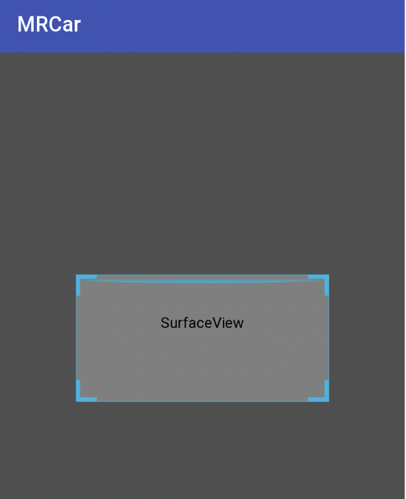

## 基于EasyPR的车牌识别android实现

EasyPR4Android，基于[EasyPR](https://github.com/liuruoze/EasyPR)1.6的android实现, 提供编译好的[mrcar.apk](mrcar.apk)安装运行demo.

### 更新：

* 摄像头实时预览，多线程处理，尽享流畅体验

* 升级到1.6版

* 支持摄像头实时识别(包括JavaCameraView和原生摄像头NV21两种方式)

* 添加putText中文支持

* 采用动态注册机制注册jni函数

* 将模型路径带入初始化函数中使得模型位置可以自由指定

* 采用CMake大幅简化ndk开发的配置

### 特性：

* 1.支持实习摄像头识别和拍照图库浏览识别

* 2.jni调用OpenCV

* 3.动态注册jni函数

* 4.采用多线程进行识别处理

采用android studio3.2开发实现，ndk版本为R16b，OpenCV版本为3.2，android SDK版本为28，最低要求21。

app启动时会默认从assets加载测试图片，并进行识别，返回结果。点击相机按钮进行拍照识别，点击文件夹按钮从图库选择文件进行识别（兼容android 4.4版本及以上）。

### 编译方法：

* 1.下载并配置[android studio 3.2](http://www.android-studio.org/)

* 2.安装编译环境[ndk r16b](http://blog.csdn.net/shuzfan/article/details/52690554)

* 3.配置opencv库，opencv android3.2版
使得解压后的OpenCV-android-sdk与本工程根目录处于同一级目录

* 4.编译并运行，也可以直接下载编译好的[apk](mrcar.apk)安装使用

本项目定义了三个Activity, 其中

* [PhotoActivity](app/src/main/java/yanyu/com/mrcar/PhotoActivity.java)是从图片和系统相机抓取图片进行识别

* [CVCameraActivity](app/src/main/java/yanyu/com/mrcar/CVCameraActivity.java)是用OpenCV的JavaCameraView实时识别，由于OpenCV实现的限制，其只能用于横屏，虽然也有tricj能使其支持竖屏，但均不太完美，为此产生了第三种

* [CameraActivity](app/src/main/java/yanyu/com/mrcar/CameraActivity.java)原始摄像头实时识别，抓取NV21数据送到jni中，并将其抓换成RGB数据进行处理，其支持竖屏识别。

### 参考：

* 1.[Android Studio 2.3利用CMAKE进行OpenCV 3.2的NDK开发](http://johnhany.net/2017/07/opencv-ndk-dev-with-cmake-on-android-studio)

* 2.[Android Studio 开发opencv3应用](https://wenku.baidu.com/view/8665a8efcc17552706220881)

* 3.[Native方式集成OpenCV](https://github.com/ShawnZhang31/opencv-android-studio)

* 4.[Android 使用OpenCV的三种方式(Android Studio)](http://blog.csdn.net/sbsujjbcy/article/details/49520791)

* 5.[freetype2-android](https://github.com/cdave1/freetype2-android)

* 6.[JNI两种注册过程实战](https://blog.csdn.net/xsf50717/article/details/54693802)

* 7.[Android集成OpenCV并减少库大小](https://blog.csdn.net/suwk1009/article/details/79746724)

* 8.[Android Camera1 教程 · 第二章 · 预览](https://www.jianshu.com/p/705d4792e836)

* 9.[ios 端车牌识别](https://github.com/imistyrain/EasyPR-Swift)